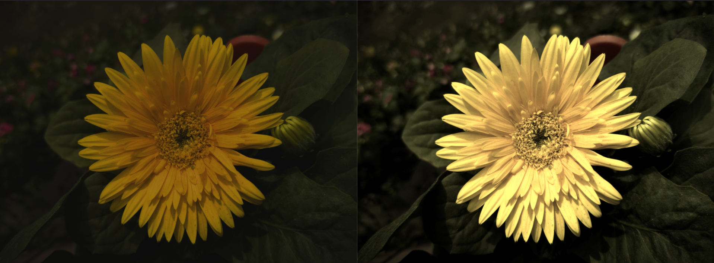
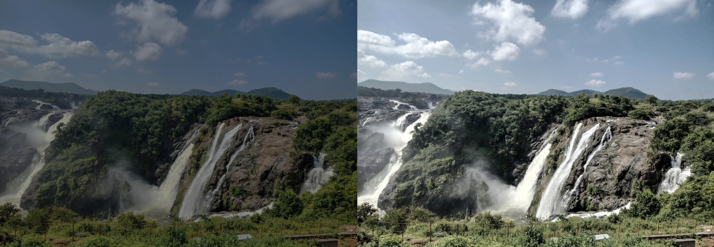
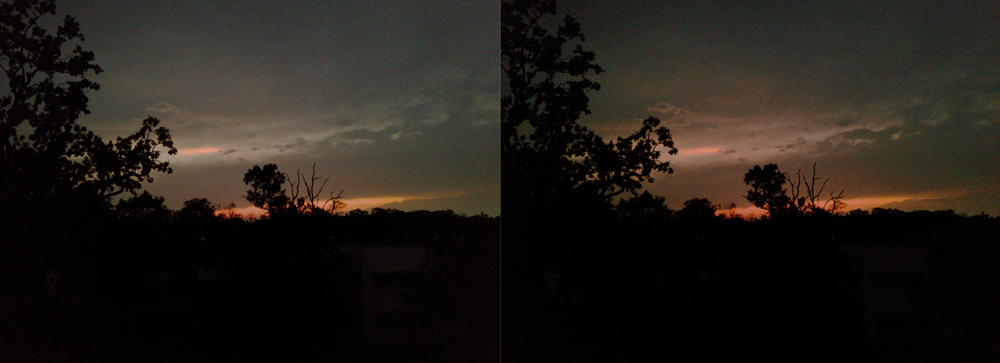

## DI3P

### Clone & Build

```bash
git clone https://github.com/hazraChandrima/di3p
cd di3p/

mkdir build && cd build

cmake ..
make
```

### Run

Inside the `build/` directory:

```bash
./enhancer
```

you will be prompted the following:

```bash
image enhancer
--------------
input image: <relative_path_of_source>

mode:
  1) manual  - pick effects yourself
  2) auto    - diagnose and fix automatically
  3) diagnose only - no changes
  4) segmentation view - just show regions

```

Select according to your needs.


**Manual:** Apply effects (sharpen, denoise, exposure fix, remove blockiness) one at a time in any order with custom parameters. You control everything.

**Auto:** The image is segmented into K regions; each region is independently diagnosed and corrected. Prints a per-region report with blur, noise, exposure, and blockiness scores before saving the enhanced output.


## Results

### 1. Manual Mode

<div align="center">
  
  <div align="center">Input Image(left), enhanced image(right)<br/></div>
</div>

<br/>


<div align="center">
  
  <div align="center">Input Image(left), enhanced image(right)<br/></div>
</div>

<br/>


### 2. Automatic Mode

<div align="center">
  
  <div align="center">Input Image(left), enhanced image(right)<br/></div>
</div>

<div align="center">
  
  <div align="center">k = 4 segmentation of the above image<br/></div>
</div>
