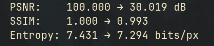

## DI3P

### Clone & Build

```bash
git clone https://github.com/hazraChandrima/di3p
cd di3p/

mkdir build && cd build

cmake ..
make
```

### Run

Inside the `build/` directory:

```bash
./analyzer ../images/fields.jpg [K=4]
```

---

## Sample Results

### Input Image

<p align="center">
  
</p>

---

## Results

| K | Segmentation | Enhanced Output | Evaluation Metrics |
|:-:|:---:|:---:|:---:|
| **4** |  |  |  |
| **6** |  |  |  |
| **10** |  |  |  |
| **14** |  |  |  |
| **20** |  |  |  |
